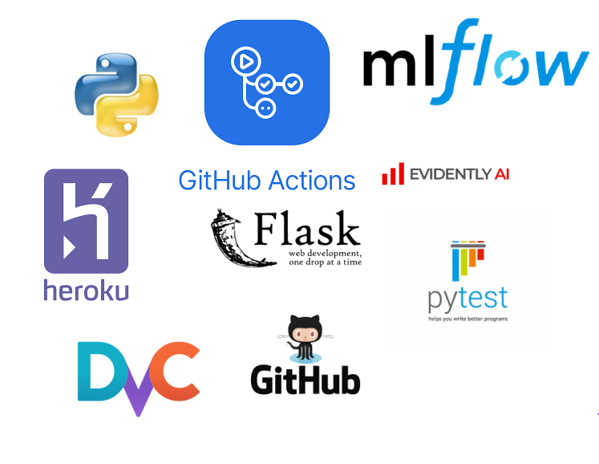

Backorder_Analytics_MLOps
==============================

End to End Machine learning pipeline with open-source MLOps tools

  

In this project, we build an end-to-end machine learning operations (MLOps) pipeline with open-source tools. Here we extend the **[backorder predictor project](https://github.com/mfalila/Supply_Chain_Analytics)** by adding an mlops pipeline to deploy the backorder model in production. The resulting pipeline will check for data drift whenever new training data is received, retrain the model using the new training dataset, and automatically deploy to production the best performing model.  
We use the tools below:

- Cookiecutter                   <- to set the project’s structure
- Data Version Control(dvc)      <- handles version control of data assets
- GitHub                         <- handles code version control
- GitHub Actions                 <- for building a ci-cd pipeline
- MLFlow 	                       <- for model version control
- Heroku                         <- to deploy best model as web app/ API
- Flask                          <- to create web app/ API
- Evidently                      <- to monitor deployed production model
- Pytest                         <- to perform application unit tests

Project Organization
------------

    ├── LICENSE
    ├── README.md                 <- The top-level README for developers using this project.
    ├── .dvc
    ├── .github                   <- Scripts to perform automatic deployment to Heroku PAAS
    |    └── workflows
    |        └── ci-cd.yaml       <- Continuous intergration and continuous deployment pipeline with github actions
    ├── build_library
    |    ├── __init__.py          <- Makes build_library a Python module
    |    └── utils.py             <- Utility scripts   
    ├── data
    │   ├── external              <- Data from third party sources.
    │   ├── interim               <- Intermediate data that has been transformed.
    │   ├── processed             <- The final, canonical data sets for modeling.
    │   └── raw                   <- The original, immutable data dump.
    │
    ├── docs                      <- A default Sphinx project; see sphinx-doc.org for details
    ├── mlflow-run                <- Saved mlfow artifacts
    │
    ├── models                    <- Trained and serialized models, model predictions, or model summaries
    │
    ├── notebooks                 <- Jupyter notebooks. Naming convention is a number (for ordering),
    │                                the creator's initials, and a short `-` delimited description, e.g.
    │                                `1.0-jqp-initial-data-exploration`.
    ├── prediction_service 
    │   └── model                 <- Production model artifacts
    ├── references                <- Data dictionaries, manuals, and all other explanatory materials.
    │           
    ├── reports                   <- Generated analysis as HTML, PDF, LaTeX, etc.
    │   └── figures               <- Generated graphics and figures to be used in reporting
    │
    ├── requirements.txt          <- The requirements file for reproducing the analysis environment, e.g.
    │                                generated with `pip freeze > requirements.txt`
    │
    ├── setup.py                  <- makes project pip installable (pip install -e .) so src can be imported
    ├── src                       <- Source code for use in this project.
    │   ├── __init__.py           <- Makes src a Python module
    |   |
    │   ├── data                  <- Scripts to download or generate data
    │   │   ├── load_data.py
    |   |   ├── split_data.py
    |   |   ├── transform_data.py
    |   |   └── make_dataset.py
    │   │
    │   ├── models               <- Scripts to train models and then use trained models to make
    │   │   │                       predictions
    │   │   ├── predict_model.py
    │   │   |── train_model.py
    |   |   └── production_model_selection.py         
    │   │
    │   └── visualization        <- Scripts to create exploratory and results oriented visualizations
    │       └── visualize.py
    │
    ├── tests                    <- Scripts to perform unit testing
    │   ├── __init__.py
    │   └── test_config.py
    |
    ├── webapp                  <- Scripts for web applications
    │   ├── static
    |   |   └── css    
    |   |       └── main.css
    │   └── templates
    │       ├── 404.html
    │       ├── base.html
    │       └── index.html
    |
    ├── app.py                 <- Scripts for flask application
    ├── dvc.yaml               <- dvc pipeline
    ├── model_monitor.py       <- Scripts to monitor model performance and data drift with Evidently
    └── params.yaml            <- Configuration parameters
    
    
    
    
# Deployment

The final deployed production model can be accessed from **[Backorder Predictor API](https://backorder-analytics-production.herokuapp.com/)**

Here a user can request predictions by either sending model inputs through completing the web form or by sending an api post request to https://backorder-analytics-production.herokuapp.com/ in a json format.

